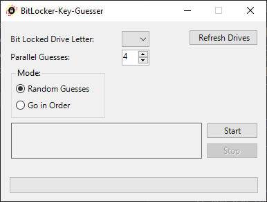

# BitLocker-Key-Guesser
PowerShell script to guess the BitLocker key for a Bit Locked drive.

## Running the Program
Download the [latest zip file](https://github.com/DiadNetworks/BitLocker-Key-Guesser/releases/latest).  
Run `BitGuesser.bat` as an administrator.  
Refer to the [controls section](https://github.com/DiadNetworks/BitLocker-Key-Guesser#controls) below for an explanation of the GUI controls.

## Controls
  
  
**Bit Locked Drive Letter:** Use this dropdown to select the bit locked drive that you want to guess the key for.  
  
**Refresh Drives:** Use this button to refresh the list of drives. Useful if you ran the program before plugging in the bit locked drive.  
  
**Amount of processes to run:** Select how many processes you want the program to start. Each process will make independent guesses on the bit locked drive. Recommended to do between 100-1000 and more if your computer can handle it. Be careful of going to high with this.  
  
**Info Window:** Displays info regarding the running processes. Currently only displays the amount of processes running (as of now, this number is only updated when using the start and stop buttons).  
  
**Start:** Click this when you're ready to start guessing the key. It will start the processes using the drive letter and amount that you specified.  
  
**Stop:** Click this if you want to close all running processes. Since the guesses are random, stopping and starting is ok.  
  
**Progress Bar:** Just lets you know something is going on.  

## What happens if it guesses correctly?  
If one of the processes guesses the correct key, it will unlock the drive and output the key to `SuccessfulKey.txt` in the same folder as `BitGuesser.bat`.  

The program won't know when the correct key is guessed and the drive has been unlocked, so you will need to use the stop button to close all the running processes if you see the drive has been decrypted.  

**Note:** The program won't permanently decrypt the drive, so make sure you go to control panel and do that if that's what you want. If you plan on leaving the drive encrypted, then save the key from `SuccessfulKey.txt`.